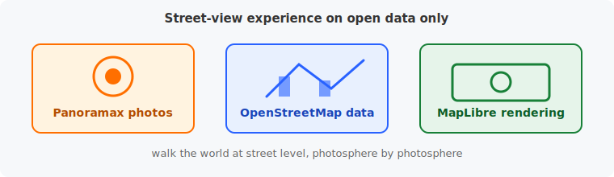
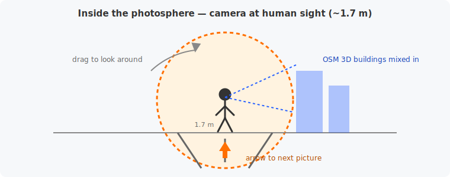
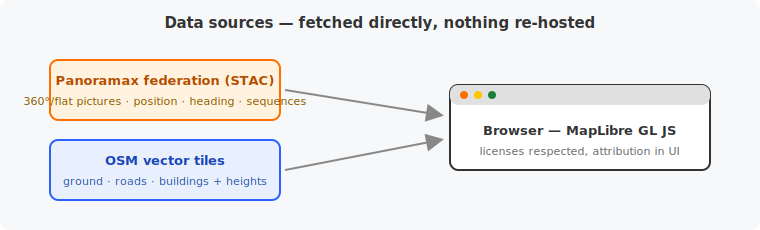
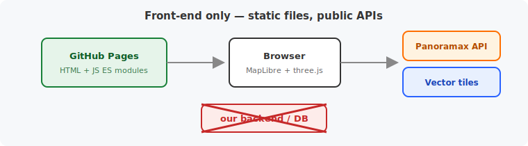
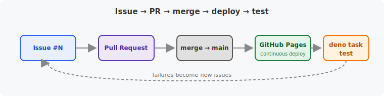
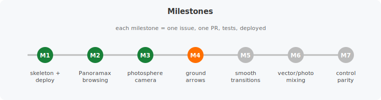
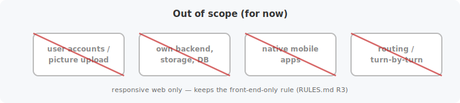
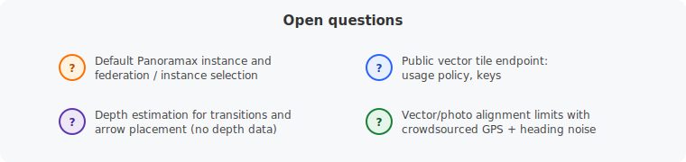

# MapMax — Specifications

Immersive street-level navigation built from [Panoramax](https://panoramax.fr) imagery, rendered inside a [MapLibre GL JS](https://maplibre.org) map.

## 1. Vision

Provide a Google-Street-View-like experience on top of open data only:

- **Photos**: Panoramax (federated, open-licensed street-level imagery).
- **Map data**: OpenStreetMap (vector tiles).
- **Rendering**: MapLibre GL JS.

The user navigates the world at street level, from photosphere to photosphere, with the vector map (ground, buildings) blended into the photographic view.

## 2. Core requirements

### 2.1 Photosphere rendering in MapLibre

- Panoramax pictures (equirectangular 360° images, and flat images when that is all that exists) are displayed **inside the MapLibre scene** — as part of, or the full content of, a photosphere surrounding the camera.
- The photosphere is not a separate viewer bolted next to the map: it is integrated in the MapLibre rendering (custom layer / custom WebGL, or equivalent), so vector layers and photo share one camera and one projection.

### 2.2 Camera: human sight, street view only

- Navigation is **exclusively street-view focused**: the camera sits at human eye height (~1.6–1.8 m above ground) at the position where the picture was shot.
- No free-flying camera, no top-down map navigation mode (a minimap may exist as UI, but the main scene stays at street level).
- Camera orientation is initialized from the picture's heading metadata.

### 2.3 Navigation between pictures

- Moving from one picture to another is done by clicking **arrows drawn on the street/road surface**, pointing toward neighboring pictures (same Panoramax sequence, or nearby sequences at intersections).
- Arrows are positioned using picture GPS positions and the road geometry; they must visually lie on the ground plane.

### 2.4 Smooth transitions

- Transition between two close pictures must be **smart enough to feel like continuous movement** — no hard cut, no white flash.
- Expected techniques (to be evaluated): cross-fade combined with a forward zoom/dolly of the current sphere toward the target position, reprojection of the current image during the move, progressive load of the target picture (thumbnail → full resolution).
- Target: the user perceives walking/driving along the street, not teleporting.

### 2.5 Controls (Google Street View parity)

- **Drag** (mouse / touch): look around (pan the view inside the sphere).
- **Click on ground arrow**: move to the adjacent picture.
- **Scroll / pinch**: zoom (FOV change).
- **Keyboard**: arrow keys to look around and advance.
- **Double-click on a point in the street**: jump to the nearest picture facing that point (nice-to-have).

### 2.6 Ground and buildings

- **Ground**: OSM rendering (vector tiles styled in MapLibre) serves as the ground plane under/behind the photo.
- **Buildings**: 3D elevation using MapLibre capabilities (`fill-extrusion`) from OSM vector data (building footprints + height/levels tags).

### 2.7 Vector / photo mixing

- Vector layers (roads, buildings, POIs, labels) must be **mixable with the photo inside the photosphere** (equirectangular projection): e.g. building outlines, street names or navigation arrows drawn over the photographic image, aligned with reality as well as heading/position metadata allows.
- The blend ratio should be adjustable (photo only ↔ mixed ↔ vector only), at least as a debug/setting control.

## 3. Data sources

| Data | Source | Notes |
|---|---|---|
| 360°/flat pictures + metadata | Panoramax API (STAC-based) | position, heading, sequence links, tiled/derivate image URLs; federated instances (panoramax.openstreetmap.fr, IGN, …) |
| Vector tiles (ground, roads, buildings) | OSM-based public vector tile endpoint | style compatible with MapLibre; building heights from OSM tags |

No scraping, no re-hosting of imagery: pictures are fetched directly from Panoramax instances, respecting their licenses (attribution displayed in the UI).

## 4. Architecture constraints

- **Front-end only.** No backend of ours, no database of ours. Everything runs in the browser against public APIs (Panoramax, vector tiles).
- Static site, deployable as plain files.
- Stack (proposed): TypeScript + Vite + MapLibre GL JS; WebGL for the photosphere (MapLibre custom layer, possibly Three.js inside it).

## 5. Project workflow

- **Repository**: dedicated GitHub repository under the `clement-igonet` account (`clement-igonet/mapmax`), public.
- **Issues & PRs**: every issue, improvement, expectation and its solution/implementation is tracked as a GitHub Issue and resolved through a Pull Request referencing it. No direct pushes of feature work to `main` once the skeleton exists.
- **Continuous deployment**: GitHub Pages. Every merge to `main` is deployed automatically.
  - Phase 1: Pages "deploy from branch" (static files at repo root or `/docs`).
  - Phase 2: GitHub Actions workflow building the Vite app and publishing to Pages (requires a token/permissions with `workflow` scope).
- **Tests** ([RULES.md](RULES.md) R1): each issue exposes a unit or end-to-end test; the whole suite (`deno task test`) is run after each deployment against the live site.

## 6. Milestones

1. **M1 — Skeleton & deployment**: repo, static page, MapLibre map with OSM vector style + 3D buildings, deployed on GitHub Pages.
2. **M2 — Panoramax browsing**: query Panoramax API around a location, show picture positions/sequences on the map.
3. **M3 — Photosphere**: render one equirectangular Panoramax picture as a photosphere with street-view camera (drag to look, zoom).
4. **M4 — Navigation arrows**: ground arrows to neighboring pictures, click to move (hard cut allowed at this stage).
5. **M5 — Smooth transitions**: continuous-movement transition between close pictures.
6. **M6 — Vector/photo mixing**: buildings, road edges and labels blended into the photosphere; adjustable blend.
7. **M7 — Street View control parity**: keyboard, pinch, double-click-to-go, minimap.

## 7. Non-goals (for now)

- No user accounts, no picture upload/contribution flow.
- No own backend, storage or database.
- No mobile native app (responsive web only).
- No routing/turn-by-turn navigation.

## 8. Open questions

- Which Panoramax instance(s) to use by default, and how to handle federation/instance selection.
- Choice of the public vector tile endpoint (usage policy, keys) for OSM ground + buildings.
- Depth estimation for better transitions and arrow placement (Panoramax provides no depth data — geometric approximations only?).
- How far vector/photo alignment can go given GPS/heading noise in crowdsourced imagery.
